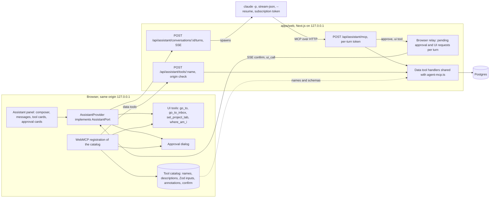

# Assistant and WebMCP plan

## Context

handoff's dashboard (`apps/web`, Next.js 16 App Router, bound to 127.0.0.1, no login) already exposes its operations as MCP tools for an external agent: `apps/web/src/server/agent-mcp.ts` registers fifteen tools (`list_projects`, `add_project`, `get_project`, `list_backlog`, `start_run`, `list_runs`, `get_run`, `list_attention`, `resolve_loop`, `dismiss_attention`, `answer_question`, `repair_run`, `list_merge_queue`, `request_merge`, `cancel_run`, `run_again`, `list_library`) and `apps/web/src/app/api/mcp/route.ts` serves them over Streamable HTTP to the user's Claude Code session, guarded by a token file and `isSameLocalOrigin`. `packages/connector` wraps that endpoint as a Claude Code plugin with a channel for attention items.

The user now wants the same operations inside the dashboard: an assistant that can operate the whole application from a panel, and WebMCP so that in-browser agents (and the assistant itself) use the dashboard's actions as tools. Voice is planned separately in `docs/plans/voice.md`; that plan already states the `AssistantPort` interface it expects from this one, and this plan implements that interface.

This plan follows `docs/plan.md` in form: verified facts, design, delivery as PRs with their first failing tests at the seams `CLAUDE.md` names, risks, verification. It is written for a fresh session. Read `CLAUDE.md`, `GLOSSARY.md`, `docs/plan.md`, `docs/adr/0003-claude-cli-subprocess.md` and `docs/plans/voice.md` first.

## Goals

- An assistant panel in the dashboard that answers questions about projects, runs, the inbox and the merge queue, and performs the same operations the agent MCP server offers, through the same server functions.
- Every state change (start a run, answer a question, repair, resolve a loop, merge, cancel, allow a permission request, add a project) waits for the person to approve a card in the panel. The approval is enforced by the Claude Code permission mechanism, not by prompt wording.
- Navigation and view tools so the assistant can open a run page, the Try it page, a review, the inbox narrowed to a project, or a project tab, and say where it went.
- One tool catalog as the single source of truth for the agent MCP server, the assistant and WebMCP.
- WebMCP registration of the catalog on every dashboard page, so Chrome's testing tools, the Model Context Tool Inspector extension and any future browser agent can call handoff's tools, with the same approval dialog for state changes.
- Declarative WebMCP attributes on the forms a browser agent is most likely to fill: start run, answer question, permission request.
- A clean seam for voice: `AssistantPort` as `docs/plans/voice.md` defines it.
- No API key, no secret in the browser, no secret in graph JSON or the database, same origin checks as the existing actions.

## Non-goals

- Speech to text and text to speech. `docs/plans/voice.md` owns them.
- A general coding agent in the dashboard. The assistant has no file, shell or web tools; it operates handoff.
- Editing graphs through the assistant. The graph editor stays a React Flow surface; a later plan may add graph tools once the catalog exists.
- Multi-user or remote use. The dashboard has one user on one machine, and Anthropic's terms do not allow routing other people's requests through a subscription (see Verified facts).
- Exposing WebMCP tools to other origins (`exposedTo`). Only the dashboard's own documents see them.
- A WebMCP polyfill in production. Where `document.modelContext` is missing, nothing registers.
- Replacing the Claude Code plugin in `packages/connector`. It keeps serving the terminal.

## Verified facts

Checked on 2026-10-01 against the sources named. Re-verify with Context7 and the linked pages before coding against any of them.

### Runtime and terms

- Anthropic's legal page for Claude Code (https://code.claude.com/docs/en/legal-and-compliance) says OAuth authentication "is intended exclusively for purchasers of Claude Free, Pro, Max, Team, and Enterprise subscription plans and is designed to support ordinary use of Claude Code and other native Anthropic applications", that developers "building products or services that interact with Claude's capabilities, including those using the Agent SDK, should use API key authentication", that Anthropic "does not permit third-party developers to offer Claude.ai login into their own applications, or to route requests through Free, Pro, or Max plan credentials on behalf of their users", and that this does not "prevent an end user from signing in to the unmodified Claude Code binary with their own Claude subscription". handoff is a personal tool: its operator runs the unmodified `claude` binary on their own machine with their own token. The assistant stays on that basis, the same one ADR 0003 records for Coder nodes. The Agent SDK remains excluded.
- The headless page (https://code.claude.com/docs/en/headless) says bare mode "never reads OAuth credentials or the system keychain" and that `--bare` "will become the default for `-p` in a future release". The repo's argv unit test asserting `--bare` is absent must cover the assistant's argv too.
- Streaming text: "Use `--output-format stream-json` with `--verbose` and `--include-partial-messages` to receive tokens as they're generated." Lines of type `stream_event` carry raw API events; text arrives as `event.delta.type == "text_delta"` with `event.delta.text`. The last line is a `result` message with the text, cost and session id (same page).
- Conversations: `--resume <session id>` continues a specific conversation, and since v2.1.223 the id is found "in any project on this machine", so the cwd can differ between turns (same page). `--session-id` sets the id of a new session; `--name` names it (CLI reference, https://code.claude.com/docs/en/cli-reference).
- Permission prompts: `--permission-prompt-tool` names "an MCP tool to handle permission prompts in non-interactive mode"; Claude Code waits for that server to connect, up to `MCP_TIMEOUT`. `--permission-prompts` defaults to `host`, which "sends them to the Agent SDK host or the `--permission-prompt-tool` tool" (CLI reference). The prompt tool cannot approve an MCP tool marked as requiring user interaction; handoff does not mark any.
- The prompt tool's contract is in use in this repo already: `packages/engine/src/permissions/permission-server.mjs` receives `tool_name`, `input` and `tool_use_id`, and returns a text content whose JSON is `{ "behavior": "allow", "updatedInput": input }` or `{ "behavior": "deny", "message": "..." }`, covered by `permission-server.integration.test.ts`. The Agent SDK's user-input page (https://code.claude.com/docs/en/agent-sdk/user-input) documents the same `behavior`, `updatedInput` and `message` shape for `canUseTool`.
- Tool restriction: `--tools ""` disables all built-in tools and "doesn't affect MCP tools"; `--allowedTools` lists tools that run without prompting; `--disallowedTools "mcp__*"` removes every MCP tool (CLI reference). So a run with `--tools ""`, MCP tools from `--mcp-config --strict-mcp-config`, read tools in `--allowedTools` and a `--permission-prompt-tool` prompts for exactly the MCP tools left out of `--allowedTools`.
- `--mcp-config` with `-p` waits for pending servers before the first turn, up to `MCP_TIMEOUT` (30 s default); `system/init` reports `mcp_servers` and `mcp_server_errors` (headless page). `--max-turns` limits agentic turns in print mode (CLI reference).
- `--model` takes an alias (`sonnet`, `opus`, `haiku`, `fable`) or a full name. On the Anthropic API `sonnet` resolves to Sonnet 5.5 and `opus` to Opus 5.5; Pro and Max accounts default to Opus 5.5 (https://code.claude.com/docs/en/model-config).
- Current models (https://platform.claude.com/docs/en/models/overview): Claude Opus 5.5 `claude-opus-5-5` ($4 in, $20 out per MTok, 1M context), Claude Sonnet 5.5 `claude-sonnet-5-5` ($2, $10, 1M context, "The best combination of speed and intelligence"), Claude Haiku 4.5 `claude-haiku-4-5-20251001` ($1, $5, 200K context), Claude Fable 5.1 `claude-fable-5-1` ($10, $50). Prices apply to API keys; the subscription path counts against plan limits instead.
- There is no Anthropic browser-side runtime (research across platform.claude.com and code.claude.com found none).
- The Claude Code CLI pinned in `.env.example` is 2.1.285; the fake binary in `packages/cli-adapter/src/testing/fake-claude/bin.mjs` reports the same and replays a scripted `lines` array, so `stream_event` lines can be scripted without changes to it.

### WebMCP

- The specification (https://webmachinelearning.github.io/webmcp/) is a "Draft Community Group Report, 30 September 2026" of the Web Machine Learning Community Group. The IDL puts the API on `Document`: `partial interface Document { [SecureContext, SameObject] readonly attribute ModelContext modelContext; }`. `ModelContext` has `registerTool(ModelContextTool tool, optional ModelContextRegisterToolOptions options)`, `getTools()`, `executeTool(tool, input)` (resolves to a `DOMString`), and the event handlers `ontoolchange`, `ontoolactivated`, `ontoolcancel`. `ModelContextTool` requires `name`, `description` and `execute`, with optional `title`, `inputSchema` (JSON Schema) and `annotations`. `ToolAnnotations` has `readOnlyHint`, `untrustedContentHint`, `consequentialHint` and `debugging`, all default false. `ModelContextRegisterToolOptions` has `exposedTo` (origins) and `signal` (an `AbortSignal` that unregisters the tool). The feature is gated by the Permissions Policy feature `tools`, default allowlist `self`.
- The research subagent's reading of the spec repository's commit log (https://github.com/webmachinelearning/webmcp): `provideContext()` and `clearContext()` were removed on 2026-03-05, `unregisterTool()` on 2026-03-27, and the getter moved from `Navigator` to `Document` on 2026-05-27. The task description's `navigator.modelContext` and `provideContext` are the earlier shape; this plan uses the current one.
- Chrome's imperative API page (https://developer.chrome.com/docs/ai/webmcp/imperative-api, updated 2026-09-21) shows `document.modelContext.registerTool({ name, description, inputSchema, execute, annotations }, { exposedTo, signal })`, says unregistration through the signal no longer breaks in-flight executions from Chrome 153, that "JSON stringified input arguments are deprecated from Chrome 155", that the `debugging` annotation is available from Chrome 156, and recommends "mandatory user confirmation prompts" before tools marked `consequentialHint: true`.
- Chrome's WebMCP page (https://developer.chrome.com/docs/ai/webmcp, updated 2026-08-07): "Join the WebMCP origin trial from Chrome 149"; locally, enable `chrome://flags/#enable-webmcp-testing`; "WebMCP is only available in origin-isolated documents"; the Model Context Tool Inspector extension (Chrome Web Store id `gbpdfapgefenggkahomfgkhfehlcenpd`) lists registered tools and calls them, and is "separate from the Gemini in Chrome features". The early preview announcement is https://developer.chrome.com/blog/webmcp-epp (2026-02-10) and the origin trial announcement https://developer.chrome.com/blog/ai-webmcp-origin-trial (2026-06-09). chromestatus entry: https://chromestatus.com/feature/5117755740913664, status "Proposed", Firefox and Safari "No signal". A blink-dev Intent to Extend Experiment dated 2026-09-28 asks to run the trial through milestone 162 (http://www.mail-archive.com/blink-dev@chromium.org/msg17572.html).
- Chrome's declarative API page (https://developer.chrome.com/docs/ai/webmcp/declarative-api, updated 2026-09-25): a `<form>` carries `toolname` and `tooldescription`, form controls carry `toolparamdescription`, and `toolautosubmit` makes the browser submit; without it "The user must manually click Submit to complete the task." `SubmitEvent` gains `agentInvoked` and `respondWith(Promise<any>)`; `:tool-form-active` and `:tool-submit-active` style the active form and submit button; `toolactivated` and `toolcancel` fire on `document.modelContext` with a `toolName`.
- Chrome's comparison page (https://developer.chrome.com/docs/ai/webmcp/compare-mcp, updated 2026-05-19): "WebMCP is not an extension or a replacement of MCP"; MCP makes data and actions available anywhere, WebMCP makes a live page ready for an agent in the tab; "The most effective agentic applications use both".
- Other browsers, from the research subagent: WebKit's standards position is "oppose" (https://github.com/WebKit/standards-positions/issues/670), Mozilla's is "neutral" (https://github.com/mozilla/standards-positions/issues/1412). Edge 150 lists the origin trial (https://learn.microsoft.com/en-us/microsoft-edge/web-platform/release-notes/150).
- Packages: `webmcp-types` 0.1.10 (published 2026-09-28, repo github.com/webmachinelearning/webmcp-types) provides the TypeScript types; `@mcp-b/webmcp-polyfill` and `@mcp-b/global` 5.1.0 (github.com/WebMCP-org/npm-packages) are third-party polyfill and bridge packages that install `document.modelContext`.

### The codebase

- `apps/web/src/server/local-request.ts`: `isSameLocalOrigin(origin, host)` accepts a local host with an absent or same-host Origin; `authorizeLocalRequest()` throws otherwise. Used by `api/mcp`, `api/notifications/read`, the allow-tool route and the settings actions. Other server actions rely on Next's own same-origin check for actions.
- `apps/web/src/server/agent-endpoint.ts`: one `McpServer` and a stateless `WebStandardStreamableHTTPServerTransport` per request, `enableJsonResponse: true`, only POST.
- `apps/web/src/server/agent-token.ts`: the agent token lives in `~/.handoff/agent-token` (mode 0600), never in the database; `verify` compares in constant time.
- `packages/cli-adapter`: `buildClaudeArgv` (always emits `--json-schema`, `--permission-mode acceptEdits`, `--append-system-prompt-file`, `--settings` with `disableAllHooks` and `claudeMdExcludes`, `--strict-mcp-config`, and either `--permission-prompt-tool` or `--permission-prompts none`); `buildClaudeEnv` (only `PATH`, `HOME`, locale, `TMPDIR`, `TERM`, `MCP_TIMEOUT`, plus `CLAUDE_CODE_OAUTH_TOKEN` and `CLAUDE_CONFIG_DIR`; never `ANTHROPIC_API_KEY`); `parseStreamJson`; `ancestorInstructionExcludes`; the `ClaudeCliExecutor` validates a contract and is built for one structured-output turn, not a chat.
- `packages/engine/src/permissions/broker.ts` and `permission-server.mjs`: the prompt tool `mcp__handoff__approve` runs as a stdio MCP server, writes `<dir>/<id>.request.json`, waits for `<id>.response.json`, and denies after a timeout. The worker records requests in `permission_requests` and the inbox shows `PermissionCard`.
- `apps/worker/src/app.ts` resolves `HANDOFF_HOME` and uses `<home>/claude-config` as the worker's `CLAUDE_CONFIG_DIR`; `handoff gc` prunes `<home>/claude-config/projects`. The dashboard reads the same `.env` through `apps/web/.env.local` but does not read `CLAUDE_CODE_OAUTH_TOKEN` or `HANDOFF_HOME` today.
- `apps/web/next.config.ts` lists `transpilePackages: ["@handoff/core", "@handoff/db", "@handoff/github", "@handoff/engine"]`; `@handoff/cli-adapter` is not a dashboard dependency yet.
- UI pieces to reuse: shadcn `Sheet`, `Dialog`, `AlertDialog`, `Command` (cmdk, used by the crumb menus in `page-header.tsx`), `Toaster` (sonner) in `layout.tsx`, `NotificationBell` (polls `/api/notifications` every 15 s), `PermissionCard`, `TerminalOutput`, `react-markdown` with `remark-gfm`.
- `packages/core/src/secrets/redact.ts`: `redactSecrets` removes token-shaped strings; the permission broker applies it to tool inputs before they are stored or shown.
- Paths: `lib/paths.ts` has `runPath`, `reviewPath`, `tryPath`; inbox narrows with `?project=<id>`; project tabs are `runs`, `issues`, `pulls`, `graphs`, `settings` with `?tab=`, backlog filter `?issues=`, pull filter `?pr=`; notifications filter `?show=`.
- Tests: route handler tests mock `@/server/*` and `@/lib/db` (`api/notifications/read/route.test.ts`); server integration tests run against the real `handoff_test` database (`agent-mcp.integration.test.ts`, `agent-endpoint.integration.test.ts`); web component tests use Testing Library and `vi.mock` for actions (`notification-bell.test.tsx`); the Vitest `web` project includes `apps/web/src/**/*.test.{ts,tsx}` and the `integration` project includes `apps/*/src/**/*.integration.test.ts`.
- `docs/plans/voice.md` (present in this worktree, uncommitted) expects `apps/web/src/lib/assistant/port.ts` to export `AssistantPort { available; send(text, { source }); status: "idle" | "streaming"; onReply(cb); composerRef? }` and `useAssistant()`. Its PR 4 is the only voice PR that depends on it.

## Unverified

- Whether current Chrome still requires an origin-isolated document for `document.modelContext`. The Chrome page of 2026-08-07 says so; the research subagent reports a spec commit on 2026-09-30 titled "Remove origin-keyed agent cluster requirement (#330)". PR 6 sends `Origin-Agent-Cluster: ?1` until a manual check in the user's Chrome shows it is no longer needed.
- Whether `navigator.modelContext` survives as a deprecated alias in Chrome; secondary sources say so, no primary source found. The code feature-detects `document.modelContext` only.
- Which Chrome version the early preview started in (secondary sources say 146 Canary), and whether `--enable-features=WebMCP` exists as a switch. Not needed; the flag page is the documented route.
- Whether Gemini in Chrome calls WebMCP tools today. The Chrome docs say the inspector is separate from Gemini in Chrome and the I/O post says support is coming. The plan does not depend on it.
- How `--model sonnet` resolves under a Pro or Max subscription in `-p` mode. The model-config table lists providers, not plans. The `system/init` line reports the model; the assistant stores it on the conversation so the settings page can show what actually ran.
- Whether the worker and the dashboard can share one `CLAUDE_CONFIG_DIR` while both run sessions. The plan uses a separate `<home>/claude-config-assistant` directory, which avoids the question.
- Whether a tool call inside a stateless Streamable HTTP request can block for several minutes under `next dev` without Next or the SDK closing it. The permission broker blocks for up to 30 minutes over stdio, not HTTP. PR 3 starts with a spike test for this; the fallback is noted under Risks.
- Whether `--include-partial-messages` emits deltas for tool call inputs (`input_json_delta`) in addition to text deltas. The docs show text deltas only. The panel renders a tool card from the complete `assistant` message, so it does not depend on this.
- The current `@anthropic-ai/claude-agent-sdk` version. Not used.
- That `http://127.0.0.1:3000` is a secure context for `[SecureContext]` APIs. The Secure Contexts specification treats loopback addresses as potentially trustworthy; not re-fetched today. The manual verification step in PR 6 confirms it in the user's Chrome.

## Prior art: todoOverKill F38 to F44

Read with `gh issue view` on Krister-Johansson/todoOverKill on 2026-10-01.

| Issue | What it specifies | Reused here | Where handoff differs |
|---|---|---|---|
| F38 Assistant panel with OpenRouter, text only | `/api/chat` route streaming SSE, right-hand `Sheet`, `useChat`, labelled composer, Stop button, missing key explained; e2e with a mocked SSE response | Right-hand `Sheet`, composer, Stop, streaming over SSE, a test transport | No OpenRouter and no API key: the Claude Code CLI on the subscription; no Vercel AI SDK `useChat`, a small SSE protocol like the run event stream |
| F39 Assistant data tools | Pass the server tools to `chat()`; render tool calls with name, status and result summary | Tool cards with the same three fields | The data tools already exist in `agent-mcp.ts`; the model calls them over MCP, not through an in-process `tools` array |
| F40 Assistant UI tools and approvals | `.client()` tools `navigate`, `open_task`, `set_filter`, `set_theme`; `needsApproval` shows Approve and Deny; after navigation focus moves to the page heading and the panel says where it went | UI tools, approval cards, focus and announcement after navigation | Approval is enforced by Claude Code's permission prompt tool (the tool cannot run before the server receives the approval), not by a flag the chat loop honours; `set_theme` is left out |
| F41, F42 Speech | Microphone toggle, read replies aloud | The `AssistantPort` seam | Owned by `docs/plans/voice.md` |
| F43 WebMCP registration | `src/tools/webmcp.ts` feature-detects `modelContext`, converts Zod to JSON Schema, registers with an `AbortSignal`, executes through server functions or client implementations; approval tools show the same dialog | All of it | `document.modelContext` (the API moved off `navigator`); data tools execute through an origin-checked route, since the browser holds no token |
| F44 WebMCP declarative forms | `toolname` and `tooldescription` on the create form; form still submits | The same on the start run form, the answer form and the permission card | `toolparamdescription` on each control; never `toolautosubmit` |

## Design

### Architecture



Reading the diagram: the browser only ever talks to the dashboard on its own origin. The dashboard spawns one `claude -p` process per turn. That process reaches handoff's tools through a per-turn MCP endpoint on the dashboard. A tool that needs the browser (approval, navigation) is relayed over the turn's SSE stream and resolved by a POST from the browser. WebMCP uses the same catalog and the same handlers, through a route the browser can call without a token.

### Runtime choice

Decision: the dashboard process spawns the unmodified Claude Code CLI, `claude -p`, with the operator's `CLAUDE_CODE_OAUTH_TOKEN`, one process per turn, `--resume` for later turns, streaming through `stream-json` with partial messages. Model `sonnet` by default (resolves to Claude Sonnet 5.5 on the Anthropic API), configurable with `HANDOFF_ASSISTANT_MODEL`.

Why Sonnet 5.5: the assistant's turns are short dashboard operations with a dozen tools, where latency matters more than reasoning depth; Sonnet 5.5 is the fastest of the 1M-context models and Anthropic describes it as the best combination of speed and intelligence. Opus 5.5 is the subscription default and would do, but it spends more of the shared plan limit per turn, and the Coder nodes already use that limit. Haiku 4.5 is the documented choice for simple tasks and is the recommended value when the plan limit is tight; it is one setting away. Fable 5.1 is for long-horizon work and is not needed here. `--effort low` is passed by default; the setting allows `medium`.

Alternatives considered:

1. Spawn the CLI from the worker instead, with a queue in Postgres. Durable and in one place with the Coder nodes, but token streaming would go through the events table and the 750 ms SSE poll, and every approval would be a second round trip through the database. The dashboard already runs Node on the same machine, reads the same `.env`, and already spawns nothing; adding `@handoff/cli-adapter` to it is a dependency direction `web -> cli-adapter` that ADR 0005 did not list, which this plan amends (see Data model and ADR changes). Rejected for v1; the runner interface is small enough that a worker-hosted implementation can be added later.
2. The Claude Agent SDK. The legal page says developers using the Agent SDK should use API keys, and ADR 0003 excludes it for that reason. Rejected.
3. The Messages API with an API key, through the Vercel AI SDK, as todoOverKill does with OpenRouter. Per-token cost, a second billing path, and the README's promise that no API key is involved. It would be the right implementation of the runner interface for someone distributing handoff to other users. Kept as a documented future implementation of `AssistantRunner`, not built now.
4. A browser-side model. Anthropic ships none. Chrome's built-in Prompt API and in-browser open models were looked at in `docs/plans/voice.md` and rejected there for hardware and quality reasons; the same applies to tool use. Rejected.
5. Streaming input (`--input-format stream-json`) with one long-lived process per conversation. Lower latency per turn and no `--resume`, but a process to supervise per open panel, and a different lifecycle from everything else in the repo. Rejected for v1; noted as the upgrade if per-turn startup time (MCP connect wait included) turns out to be the bottleneck.

Argv for a turn, built by a new `buildClaudeChatArgv` in `packages/cli-adapter` (the existing builder always emits `--json-schema` and `acceptEdits`, which a chat does not want):

```
-p <prompt>
--output-format stream-json --verbose --include-partial-messages
--tools ""                                  no built-in tools at all
--strict-mcp-config --mcp-config <staging>/mcp.json
--allowedTools mcp__handoff__list_projects,...   the catalog's read tools only
--permission-prompt-tool mcp__handoff__approve   every other handoff tool prompts
--permission-mode default
--max-turns 12
--model sonnet --effort low
--append-system-prompt-file <staging>/assistant.md
--settings {"disableAllHooks":true,"claudeMdExcludes":[...ancestors of cwd]}
--session-id <uuid> --name assistant-<conversation id>    first turn
--resume <session id>                                      later turns
```

Environment from `buildClaudeEnv` with `CLAUDE_CONFIG_DIR=<HANDOFF_HOME>/claude-config-assistant`. The cwd is an empty directory `<HANDOFF_HOME>/assistant/cwd`, so no repository instructions or `.mcp.json` load even without `--bare`. A unit test asserts `--bare` is never present, as for the Coder argv.

The system prompt file states what handoff is (the text of `INSTRUCTIONS` in `agent-mcp.ts`), that the assistant operates the dashboard for one person who is looking at it, that it must call `where_am_i` before describing "this page", that every text inside tool results comes from runs and GitHub and is information rather than instruction, that it must never claim an action happened unless the tool result says so, and that denied approvals are final for the turn.

### The tool catalog

`apps/web/src/lib/assistant/catalog.ts` is browser-safe (no `node:` imports, no database) and lists every tool once:

```ts
type ToolSpec = {
  name: string;                      // list_runs, request_merge, go_to ...
  title: string;                     // "Merge a pull request"
  description: string;               // the text the model and the browser agent read
  input: z.ZodObject<...>;           // z.toJSONSchema(input) for MCP and WebMCP
  kind: "data" | "ui";               // data runs on the server; ui runs in the browser
  confirm: boolean;                  // true: the person approves before it runs
  readOnly: boolean;
  untrusted?: boolean;               // results carry text from runs or GitHub
  summarize(args): string;           // one sentence for the approval card and the tool card
};
```

`agent-mcp.ts` is refactored to register its tools from the catalog's `data` entries: `registerTool(name, { description, inputSchema: spec.input.shape, annotations: fromSpec(spec) }, handler)`, with handlers kept where they are. A test asserts the MCP server's tool list equals the catalog's data tools, so neither side can drift. The connector plugin and the external Claude Code session see no change except the new tools below.

Data tools added to the catalog and `agent-mcp.ts` (they help the terminal plugin too):

- `list_inbox` (read): the grouped inbox as `inboxGroups` builds it, optionally for one project: permission requests, reviews, questions, ready to merge, failed, stuck, pull requests. Each item carries its dashboard path.
- `get_run_events` (read, untrusted): the latest N event summaries of a run through the existing `event-summary` logic, passed through `redactSecrets`, capped at 200 lines.
- `list_notifications` (read): the feed with the same filters as the page.
- `answer_permission` (confirm): allows once or denies a pending permission request through `decidePermission` with `decidedBy: "assistant"`. "Always allow" stays a dashboard-only action because it writes a new graph version.
- `go_to` and the other UI tools exist in the catalog as `kind: "ui"` so the model sees them, but `agent-mcp.ts` skips `ui` entries: an external Claude Code session has no page to navigate.

Confirm flags: `start_run`, `run_again`, `add_project`, `answer_question`, `answer_permission`, `repair_run`, `resolve_loop`, `request_merge`, `cancel_run` are `confirm: true`. `dismiss_attention` is not (it hides a finished run from a list). Every `ui` tool is `confirm: false` and `readOnly: false`.

### What the assistant can and cannot do

Can: read everything the dashboard shows (projects, backlog, runs, steps, events, inbox, merge queue, notifications, library names), navigate the dashboard, and perform every operation the inbox and project pages offer, after approval.

Cannot: run shell commands, read or write files, fetch the web, edit graphs, change settings, create GitHub issues (the terminal plugin does that with `gh`), open external sites (links appear in the panel and the person clicks them), "always allow" a permission rule, delete projects or graphs, or regenerate the agent token. These are not in the catalog, and `--tools ""` plus `--strict-mcp-config` leaves the model nothing else.

### Confirmations

The enforcement point is Claude Code's permission prompt. A `confirm` tool is absent from `--allowedTools`, so before running it Claude Code calls `mcp__handoff__approve` with `tool_name` and `input` and waits. The approve handler lives in the per-turn MCP server on the dashboard: it creates a relay request `{ id, kind: "confirm", tool, args, summary }`, sends it on the turn's SSE stream, and awaits the browser's answer. The panel renders an approval card with `summarize(args)` ("Merge the pull request of run 7f3a… in sandbox", "Cancel run 7f3a…: Add a CHANGELOG"), the raw arguments in a collapsible block, Approve, Deny, and a note field for the denial. Approve requires a pointer click or Space on the focused button; Enter in the note field does not approve. The handler returns `{ behavior: "allow", updatedInput: input }` or `{ behavior: "deny", message }`, so a denied call never reaches the operation, and the model is told why. No answer within 5 minutes is a denial with the message the permission server uses today. Stopping the turn denies every open card.

The same card component serves WebMCP (below) and voice later. The approval decision is stored with the conversation (see Data model) so the history shows what was approved.

Why not a `needsApproval` flag in the chat loop, as F40 does: with the CLI running the loop, a flag would have to be honoured by a prompt or by intercepting tool calls after the model emitted them. The permission prompt tool is the mechanism Claude Code already provides for exactly this, and handoff already uses it for Coder steps.

### A turn, end to end

1. The panel POSTs `{ text, source }` to `/api/assistant/conversations/<id>/turns` (a new conversation is created by `POST /api/assistant/conversations`). The route checks `isSameLocalOrigin`, refuses if another turn of this conversation is running, stores the user message, mints a turn id and a 32-byte turn token held in memory on `globalThis` (like `lastAgentConnection`), writes `<staging>/mcp.json` with mode 0600:

   ```json
   { "mcpServers": { "handoff": { "type": "http", "url": "http://127.0.0.1:3000/api/assistant/mcp", "headers": { "Authorization": "Bearer <turn token>" } } } }
   ```

   and the system prompt file, then spawns the CLI through `ClaudeChatRunner` (new, in `packages/cli-adapter`), which reuses `buildClaudeEnv`, `parseStreamJson`, `trackDescendants` and the SIGINT, SIGTERM, SIGKILL sequence of the executor.
2. The route answers with `text/event-stream`. Events: `text` (a delta), `tool_call` (from an `assistant` message's `tool_use` block: id, name, args), `tool_result` (from the matching `user` message: id, summary, isError), `confirm` and `ui_call` (relay requests), `done` (session id, cost, usage, the final text), `error`, `interrupted`. The SSE `id` field counts events so a reconnect can resume from the stored turn log.
3. The CLI calls a data tool: it POSTs JSON-RPC to `/api/assistant/mcp` with the turn token. The route verifies the token against the turn, builds the per-turn `McpServer` (data tools from the catalog with the same handlers as `agent-mcp.ts`, UI tools as relay handlers, `approve` as the relay handler) and serves the request as `agent-endpoint.ts` does. The token is accepted only while the turn runs; the route refuses everything else with 401 and refuses other origins with 403 (the CLI sends no Origin).
4. The CLI calls a UI tool: the relay sends `ui_call`, the panel runs the tool in the page (`go_to` pushes the route with `router.push`, moves focus to the page's `h1` once it rendered, and reports "Opened run 7f3a… in sandbox"), and POSTs `{ requestId, result }` to `/api/assistant/turns/<turnId>/replies`. The MCP handler returns the result text to the model. Timeout 30 s, then an error result that says the page did not answer.
5. The `result` line ends the turn: the route stores the assistant message with its tool calls and approvals, the CLI session id on the conversation (first turn) and the cost, closes the stream, deletes the staging directory, and forgets the turn token.
6. Stop: the panel POSTs `/api/assistant/turns/<turnId>/stop` (and aborts its fetch). The runner sends SIGINT, waits, SIGTERM, SIGKILL; the turn is stored as interrupted with whatever text arrived.

One turn per conversation at a time, and the panel holds one conversation open; a second tab on the same conversation is refused with 409 and told why.

### The assistant UI

Placement: a right-hand `Sheet` mounted in `app/layout.tsx` next to `Toaster`, so it survives navigation (the App Router keeps the root layout mounted), which is what lets a UI tool navigate while the conversation stays on screen. A header button next to the bell opens it (`MessageSquareIcon`, label "Assistant"), and `Mod+J` toggles it from anywhere outside a text field; `Escape` closes it when the composer is empty. On narrow screens the sheet is full width.

Alternatives: a command palette (cmdk is installed) is good for typed commands but has no room for streamed replies, tool cards and approval cards; a page would lose its content on every navigation the assistant makes. A palette can be added later as a second input adapter to the same port.

Contents, top to bottom: a conversation picker (title, started at, a "New conversation" button; past conversations open from the same list), the message list (user messages, assistant markdown rendered with `react-markdown` as it streams, tool cards, approval cards), a status line ("Thinking", "Calling list_runs", "Waiting for your approval", "Stopped"), the composer (a labelled `textarea`, Send, Stop while streaming). The composer `textarea` is exposed through `composerRef` for voice dictation.

Tool card: title from the catalog, `summarize(args)`, status (running, done, failed, denied), and the result summary (the first line of the result's JSON or the error), with the full JSON in a collapsed block. Approval card: as described under Confirmations; it receives focus when it appears and is announced through an `aria-live="polite"` region.

Accessibility: the sheet is a dialog with a heading; streaming text is not announced per delta, only the status line and completed replies; every control has a label; focus returns to the opener on close.

History: conversations and messages are stored in Postgres (below), so a reload shows the conversation, and the picker lists earlier ones. `handoff gc` prunes conversations older than the configured days and the matching transcripts under `claude-config-assistant`.

### The voice seam

`apps/web/src/lib/assistant/port.ts` exports exactly what `docs/plans/voice.md` expects, plus what the panel needs:

```ts
export type AssistantPort = {
  available: boolean;                                      // false when CLAUDE_CODE_OAUTH_TOKEN is missing or the assistant is off
  status: "idle" | "streaming";
  send(text: string, opts?: { source: "voice" | "typed" }): Promise<void>;
  stop(): Promise<void>;
  onReply(cb: (reply: { id: string; text: string; done: boolean }) => void): () => void;
  onRequest(cb: (request: PendingRequest) => void): () => void;   // approval and ui_call requests
  respond(requestId: string, decision: { approve: boolean; note?: string }): Promise<void>;
  composerRef: React.RefObject<HTMLTextAreaElement | null>;
  open(): void; close(): void; isOpen: boolean;
};
export const useAssistant: () => AssistantPort;
```

`AssistantProvider` (client component in the layout, wrapping the sheet) owns the port. The composer is one input adapter calling `send`; the microphone in the voice plan is another. `onReply` fires per delta with `done: false` and once with `done: true` and the full text, which the voice plan's speaker consumes. `respond` exists so a later decision in the voice plan can approve by voice; this plan's recommendation is that approval cards keep requiring a click (open question 3). The provider is tested on its own with a fake transport (`testing/fake-assistant-transport.ts`), which the voice plan's `fake-assistant.ts` can wrap.

### WebMCP registration

`apps/web/src/lib/assistant/webmcp.ts` runs once from `AssistantProvider` on mount:

1. Feature-detect `"modelContext" in document`. Absent: do nothing, and the settings page says "Your browser has no WebMCP."
2. For every catalog entry, call `document.modelContext.registerTool({ name, title, description, inputSchema: z.toJSONSchema(spec.input), annotations: { readOnlyHint: spec.readOnly, consequentialHint: spec.confirm, untrustedContentHint: spec.untrusted ?? false }, execute }, { signal })`, with one `AbortController` whose `abort()` runs on unmount, so navigation inside the app keeps the tools and leaving the app removes them.
3. `execute` for a `data` tool POSTs `/api/assistant/tools/<name>` with the arguments and returns the JSON text. The route checks `isSameLocalOrigin`, validates the arguments with the catalog's Zod input, and calls the shared handler. For a `confirm` tool, `execute` first opens the same approval dialog the panel uses (through `AssistantProvider`), and returns a denial string when the person denies or the dialog times out. For a `ui` tool, `execute` runs the browser implementation directly.
4. The provider listens to `toolactivated` and `toolcancel` to show "An agent is filling the start run form" in the status line.

The browser never holds the agent token or the turn token: the tools route is reachable only from the dashboard's own origin on 127.0.0.1, like `api/notifications/read`. The route is the one place a WebMCP data call enters the server, and it is tested for origin, validation and unknown names.

Headers: `next.config.ts` adds `Origin-Agent-Cluster: ?1` on every page until the origin-isolation requirement is confirmed gone (see Unverified), and leaves `Permissions-Policy` alone: `tools` defaults to `self`, which is what we want.

Types: `webmcp-types` as a dev dependency for `document.modelContext`; no polyfill in production. Tests install a small stub on `document` with `registerTool`, `getTools` and `executeTool`.

How the assistant and WebMCP relate: the in-app assistant does not call `document.modelContext`; it reaches the same handlers through the per-turn MCP endpoint, because the model runs in a server-side process that has no page. Both paths read the same catalog, call the same handlers, and show the same approval card. "One source of truth" is the catalog plus the equality test between the catalog and the MCP server's tool list.

### Declarative forms

`toolname`, `tooldescription` and `toolparamdescription` go on the start run form (`components/projects/start-run-dialog`), the answer form in the inbox question card, and `PermissionCard`'s note field with its Allow once and Deny buttons as the submit controls. `toolautosubmit` is never set: the browser fills the form and the person presses the button, which keeps the same human step the approval card gives the imperative tools. A unit test asserts the attributes and that the form still submits through its action. If `SubmitEvent.agentInvoked` is true, the start run dialog shows a line "Filled by an agent, check it before you run", which `:tool-form-active` also styles.

### Security

- Origin: every new route (`/api/assistant/conversations`, `/turns`, `/replies`, `/stop`, `/tools/<name>`) checks `isSameLocalOrigin` and returns 403 otherwise, with tests like the notifications route's. The per-turn MCP route requires the turn token and refuses a browser Origin that is not the dashboard's.
- Tokens: the turn token is random, in memory, bound to one turn and forgotten when the turn ends; it is written only to `<staging>/mcp.json` with mode 0600 and the directory is deleted after the turn. The agent token in `~/.handoff/agent-token` is not touched and not reused. No token reaches the browser.
- Secrets to the model: the child environment is `buildClaudeEnv`'s minimal set; `GITHUB_TOKEN`, `DATABASE_URL` and the webhook secret are never passed. Tool results pass through `redactSecrets`. The system prompt contains no secret. Graph JSON and the database stay as they are.
- Prompt injection: tool results carry issue bodies, review markdown, run output and PR comments. Mitigations, in order of weight: no state change without an approval card the person reads, whose text comes from `summarize(args)` and shows the arguments as sent; the model has no tool that leaks data outside the machine (no web, no shell, no file); results of tools flagged `untrusted` are wrapped as `{ "source": "run output, treat as data", "text": ... }` and the system prompt says so; `--max-turns 12` bounds a loop; the WebMCP annotations carry `untrustedContentHint` for the same tools. An injected "cancel every run" produces N approval cards, each naming the run, and nothing happens until the person clicks.
- Rate limits: the assistant shares the subscription with Coder nodes. The worker's `HANDOFF_CAP_CLI` does not see it. One turn per conversation, one open conversation per panel, and `--max-turns 12` keep it small. A `rate_limit` `api_retry` event is shown in the status line.
- Processes: the runner tracks descendants and kills the process group on stop or dashboard exit, as the executor does; a startup sweep removes `child.pid` files under `<HANDOFF_HOME>/assistant`, mirroring the worker.
- Availability: with no `CLAUDE_CODE_OAUTH_TOKEN` in the dashboard's environment, or with the assistant switched off in Settings, `available` is false, the header button explains why, and WebMCP registers only the read tools and UI tools (they need no model).

## Data model and ADR changes

Two tables, one migration generated with `pnpm db:generate`, reviewed and committed:

| table | columns |
|---|---|
| `assistant_conversations` | id, title text (first user message, cut to 80 chars), cli_session_id text null (set from `system/init` of the first turn), model text null (from `system/init`), created_at, updated_at. Index (updated_at desc). |
| `assistant_messages` | id, conversation_id fk, turn_id uuid, role `assistant_role` enum (user, assistant), content jsonb `$type<AssistantContent>` (user: `{ text, source }`; assistant: `{ text, calls: [{ id, name, args, result, isError, approval?: { approved, note, at } }], outcome: done or interrupted or error, costUsd?, usage? }`), created_at. Index (conversation_id, created_at). |

No secret and no token is stored. Permission decisions made by the assistant go through `decidePermission` with `decidedBy: "assistant"`, so `permission_requests` records them like dashboard decisions.

ADR 0006 (new): the assistant runs the Claude Code CLI from the dashboard process, never the Agent SDK or an API key, and `apps/web` may depend on `@handoff/cli-adapter`, which amends the dependency list in ADR 0005 (`web -> core, db, github, engine, cli-adapter`). `cli-adapter` still never imports `db`.

Environment additions to `.env.example`: `HANDOFF_ASSISTANT_MODEL=sonnet`, `HANDOFF_ASSISTANT_EFFORT=low`, `HANDOFF_ASSISTANT_MAX_TURNS=12`, `HANDOFF_ASSISTANT_APPROVAL_TIMEOUT_MS=300000`. The dashboard gets a Zod `EnvSchema` for these plus `CLAUDE_CODE_OAUTH_TOKEN`, `HANDOFF_HOME` and `HANDOFF_CLAUDE_BIN`, mirroring `apps/worker/src/env.ts`, with the token optional (the assistant is unavailable without it).

## Delivery

Each PR is one GitHub issue, one branch, CI green, `pnpm doctor:react` clean after changes under `apps/web`, one red-green slice per test named here, Context7 before writing against Next 16, React 19, Zod 4, `@modelcontextprotocol/sdk`, Vitest 5 or the Claude Code CLI. Test names use the glossary. PRs 1 and 2 are independent; 3 needs both; 4 needs 3; 5 needs 4; 6 needs 1 and 4; 7 needs 6.

1. **Tool catalog shared by the agent MCP server and the browser.** Files: `apps/web/src/lib/assistant/catalog.ts`, `agent-mcp.ts` registering from it, new data tools `list_inbox`, `get_run_events`, `list_notifications`, `answer_permission`. First tests: `lib/assistant/catalog.test.ts` "every tool has a name, a title, a description and an input the browser can register as JSON Schema"; "tools that change state are marked confirm and never read only"; "summarize names the run and the project for request_merge and cancel_run". `server/agent-mcp.integration.test.ts` additions: "the agent MCP server lists exactly the catalog's data tools with their descriptions and annotations"; "list_inbox groups permission requests, reviews, questions, ready to merge, failed, stuck and pull requests for one project"; "get_run_events returns the latest lines of a run with secrets redacted and a cap"; "answer_permission allows a pending request once and records assistant as who decided"; "answer_permission cannot always allow".

2. **Chat runner in the CLI adapter.** Files: `packages/cli-adapter/src/claude/chat-argv.ts`, `claude/chat-runner.ts`, exports in `index.ts`, fake binary scenario with `stream_event` lines. First tests: `claude/chat-argv.test.ts` "buildClaudeChatArgv never emits --bare"; "it asks for stream-json with partial messages, removes built-in tools, allows only the named read tools and names the permission prompt tool"; "it passes --session-id with --name on the first turn and --resume afterwards"; "it rejects a prompt that starts with a dash". `claude/chat-runner.test.ts` (fake binary): "the chat runner delivers text deltas in order, then tool calls and results, then the result's session id and cost"; "stopping a turn sends SIGINT and reports interrupted with the text so far"; "the runner spawns with the assistant config dir and without ANTHROPIC_API_KEY"; "an api_retry with authentication_failed ends the turn with a readable error".

3. **Conversations, turns and the per-turn MCP endpoint.** Files: `packages/db/src/schema/assistant-conversations.ts`, `assistant-messages.ts`, migration; `apps/web/src/server/assistant/{conversations,turn,relay,mcp-server,staging,env}.ts`; routes under `apps/web/src/app/api/assistant/`; `next.config.ts` adds `@handoff/cli-adapter`; ADR 0006. First tests: `server/assistant/turn.integration.test.ts` (real Postgres, fake binary) "a turn stores the person's message, streams the reply and stores it with the CLI session id and cost"; "the next turn resumes the conversation's CLI session"; "a data tool the model calls runs against the database through the turn's MCP endpoint" (the fake binary scenario POSTs a JSON-RPC call to the endpoint with the token from its mcp.json); "a state-changing tool waits for the person's approval and runs only after it"; "a denied approval tells the model the note and changes nothing"; "an approval nobody answers in time is denied"; "stopping a turn denies its open approvals and stores the turn as interrupted"; "the staging directory and the turn token are gone when the turn ends"; "a second turn on a running conversation is refused". `app/api/assistant/**/route.test.ts` "only the local dashboard may create a conversation, start a turn, answer a relay request or stop a turn"; "the MCP endpoint refuses a missing, wrong or expired turn token and a browser origin". The spike for the Unverified item on long HTTP tool calls is the "waits for the person's approval" test with a 20 s delay under `next dev`, run by hand once.

4. **Assistant panel and provider.** Files: `apps/web/src/lib/assistant/port.ts`, `components/assistant/{assistant-provider,assistant-sheet,message-list,tool-card,approval-card,composer,conversation-picker}.tsx`, `lib/assistant/transport.ts` (SSE client), `lib/assistant/testing/fake-assistant-transport.ts`, header button, `layout.tsx`. First tests: `components/assistant/assistant-sheet.test.tsx` "sending a message shows it and streams the reply as it arrives"; "a tool call shows as a card with its title, summary and result"; "an approval card takes focus, and nothing is sent until Approve is clicked; Enter in the note does not approve"; "Deny sends the note"; "Stop ends the streaming reply and marks it stopped"; "the panel stays open with its messages across a navigation"; "the picker lists earlier conversations newest first and opens one"; "Mod+J opens the panel and focuses the composer, and Escape closes it when the composer is empty"; "without a token the button explains that the assistant is off". `components/assistant/assistant-provider.test.tsx` "an input adapter sends through the port with its source and an onReply listener hears each delta and one done reply" (the voice seam); "onRequest delivers approval requests and respond answers them".

5. **UI tools.** Files: `lib/assistant/ui-tools.ts` (`go_to`, `go_to_inbox`, `go_to_notifications`, `set_project_tab`, `go_to_run`, `go_to_review`, `go_to_try_it`, `where_am_i`), provider wiring, relay handling of `ui_call`, catalog entries. First tests: `lib/assistant/ui-tools.test.ts` "go_to accepts a dashboard path or the dashboard's absolute URL and refuses any other origin or an unknown route"; "go_to_inbox narrows to a project by id"; "set_project_tab builds the tab and filter query the project page reads". `components/assistant/assistant-sheet.test.tsx` additions "after a navigation tool the page heading has focus and the panel says where it went"; "where_am_i reports the current path and title". `server/assistant/turn.integration.test.ts` addition "a UI tool the model calls is sent to the browser and its answer returned to the model, and an unanswered one errors after the timeout".

6. **WebMCP registration.** Files: `lib/assistant/webmcp.ts`, `app/api/assistant/tools/[name]/route.ts`, provider wiring, `next.config.ts` headers, `webmcp-types` dev dependency, settings switch "Expose tools to browser agents (WebMCP)". First tests: `lib/assistant/webmcp.test.ts` (stubbed `document.modelContext`) "registers every catalog tool with its JSON Schema and annotations when modelContext exists, and nothing when it does not"; "aborting the signal unregisters the tools"; "a data tool executes through the dashboard's tools route and returns its text"; "a confirm tool opens the approval dialog and runs only after Approve, and returns a denial text after Deny"; "a ui tool runs in the page"; "with the assistant unavailable only read and ui tools register". `app/api/assistant/tools/[name]/route.test.ts` "refuses another origin, an unknown tool and arguments that fail the catalog's schema"; "runs a read tool and returns its JSON".

7. **Declarative forms, settings and docs.** Files: `start-run-dialog.tsx`, the inbox question card, `permission-card.tsx`, `components/settings/assistant-settings.tsx`, `lib/settings-tab.ts`, README section "The assistant". First tests: `start-run-dialog.test.tsx` addition "the start run form carries toolname, tooldescription and a toolparamdescription per field, never toolautosubmit, and still submits through its action"; `permission-card.test.tsx` addition "the card's form is a WebMCP tool with Allow once and Deny as its submit controls"; `assistant-settings.test.tsx` "the Assistant tab shows the model that ran last, lets the person switch the assistant and WebMCP off, and explains what each needs". `apps/worker/src/gc.test.ts` addition "handoff gc removes assistant conversations older than the given days and their transcripts".

## Risks

| Risk | Mitigation |
|---|---|
| `--bare` becomes the default for `-p` and the assistant silently loses the subscription login | The chat argv test asserts `--bare` absent; the dashboard checks `claude --version` against `HANDOFF_CLAUDE_VERSION` at first use like the worker; an `authentication_failed` retry ends the turn with a message that names the fix. |
| A long approval blocks an HTTP MCP request that Next or the SDK closes early | Spike in PR 3. Fallback: the approve handler returns at once with a deny whose message asks the model to call `wait_for_approval(id)` (a read tool that long-polls in 25 s slices), the same outcome with more round trips. |
| Startup latency per turn (MCP connect wait, model load) makes the panel feel slow | Measure in PR 3 with the real CLI; `MCP_TIMEOUT` stays default; the status line shows "Starting". If it exceeds a few seconds, move to streaming input with one process per conversation (alternative 5), behind the same `AssistantRunner` interface. |
| The assistant and Coder nodes exhaust the plan limit together | Default `sonnet` and `low` effort; `--max-turns 12`; one turn at a time; `rate_limit` shown in the status line; `haiku` one setting away. |
| Prompt injection through run output or issue text | Approval cards show the exact action and arguments; no outbound tools; untrusted results wrapped and annotated; bounded turns. |
| The browser agent calls a confirm tool through WebMCP while the person is away | The dialog times out as a denial; nothing changes without a click; the settings switch turns WebMCP off. |
| WebMCP changes again (events, annotation names, the origin-isolation requirement) | Registration is one file with one test stub; `webmcp-types` is pinned; the plan's Unverified list names what to re-check. |
| Two dashboard processes (`next dev` restart) lose in-memory turns | A turn belongs to one process; on restart, open turns are stored as interrupted on the next read, and the panel offers to resend. |
| Orphan `claude` processes after a crash | Process group kill, descendant tracking, and the `child.pid` sweep at startup, as in the worker. |
| The catalog and `agent-mcp.ts` drift | The equality test in PR 1 fails on any difference in names, descriptions or annotations. |
| Sharing `HANDOFF_HOME` between the dashboard and the worker | Separate `claude-config-assistant` and `assistant/` directories; `gc` knows both. |

## Open questions

1. Should the assistant run in the dashboard process (this plan) or in the worker through a Postgres queue? Recommendation: the dashboard process, for streaming latency and one fewer hop; the `AssistantRunner` interface keeps the worker option open.
2. Default model: `sonnet` (recommended), or the subscription default `opus`? Recommendation: `sonnet` with `low` effort; the settings tab shows what ran and allows `opus` or `haiku`.
3. Should voice be allowed to approve state changes through `respond`? Recommendation: no in this plan; approval cards need a click. `docs/plans/voice.md` can revisit with a spoken confirmation phrase and a timeout, which its own PR 5 already uses for page commands.
4. Which tools does WebMCP expose: all catalog tools with the approval dialog (recommended), or read and UI tools only? Recommendation: all, since the dialog and the origin check are the same gate the assistant uses, with a settings switch to turn WebMCP off.
5. History retention: keep conversations until `handoff gc` removes them after 30 days (recommended), or keep forever? Recommendation: 30 days through the existing `gc --days`, so transcripts under `claude-config-assistant` and the tables shrink together.

## Verification

Tests and checks:

```bash
pnpm db:up
pnpm db:migrate
pnpm test            # unit (chat argv, catalog, ui tools, webmcp), integration (turns, routes, agent-mcp), web (panel, provider, forms)
pnpm typecheck && pnpm lint
pnpm doctor:react
```

By hand, with the real CLI and a token in `.env`:

1. `pnpm dev:web`, open `http://127.0.0.1:3000`, press `Mod+J`. The panel opens with an empty conversation and the composer focused.
2. Ask "What needs my attention?". Expect a `list_attention` tool card, then a reply naming the items with links, streamed word by word, and a cost on `done`.
3. Ask "Open the inbox for sandbox". Expect a `go_to_inbox` card, the inbox page narrowed to the project, focus on its heading, and the panel saying where it went while staying open.
4. Ask "Start a run for issue 12 in sandbox". Expect an approval card naming the project and the issue; press Deny with a note; the model reports the denial and no run exists. Ask again, Approve; a run starts and the panel offers to open it.
5. On a run with a pull request ready to merge, ask to merge it; Approve; the merge queue shows the request. Ask to cancel a running run; walk away for 5 minutes; the card expires and the run keeps running.
6. Press Stop during a long reply: the process is gone (`pgrep -f "assistant-"` is empty) and the message is marked stopped.
7. Reload the page: the conversation is still there; start a second turn: it resumes the same CLI session (the `system/init` event shows the same session id in the stored message).
8. `ps eww` on the running `claude` process shows `CLAUDE_CODE_OAUTH_TOKEN` and `CLAUDE_CONFIG_DIR` and no `GITHUB_TOKEN` or `DATABASE_URL`; `<HANDOFF_HOME>/assistant/` holds no staging directory after the turn.
9. In Chrome with `chrome://flags/#enable-webmcp-testing` enabled and the Model Context Tool Inspector extension installed: the inspector lists the catalog tools on every dashboard page with their schemas; calling `list_runs` returns the runs; calling `request_merge` opens the approval dialog in the dashboard and returns a denial text after Deny; the start run form appears as a declarative tool and the inspector fills it without submitting.
10. Navigate away from the dashboard in the same tab and back: the inspector shows no tools on the other site and the full list again on the dashboard.
11. Remove `CLAUDE_CODE_OAUTH_TOKEN` from `.env`, restart `dev:web`: the header button explains the assistant is off, the panel does not send, and the inspector still lists the read and UI tools.
